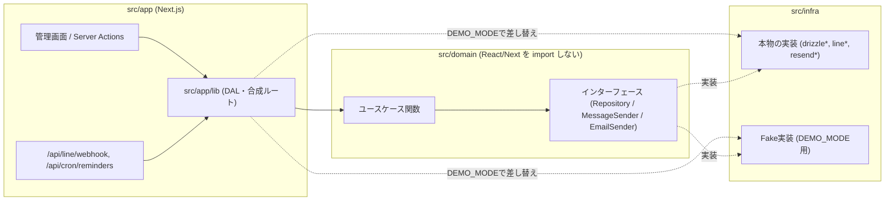

# みらい不動産 CRM

不動産の空き家管理・売買仲介を1人で営む事業者を想定した、LINE連携の顧客管理システムです。

## これは何のためのシステムか

不動産業を1人で営む事業者が抱える、次の3つの課題を解決することを目的にしています。

1. LINE登録者に「売主」「買主」等のタグを付け、属性別にまとめて配信したい
2. 契約日を基準に「2週間ごとの業務報告期限」「3ヶ月ごとの更新時期」を自分に通知してほしい
3. 現場写真をアップすると報告書の草案ができ、確認・修正のうえ顧客のLINEに送れるようにしたい

管理画面はスマートフォンでの利用を前提に作っています。

## デモを触る

`DEMO_MODE=true` の場合、LINEへの送信・メール送信・R2への保存は行われず、
すべてサーバーのメモリ上に記録されるだけの疑似実装（`src/infra/fake/`）に差し替わります。
送信結果はLINEのトーク画面風のプレビューで確認できます。

```bash
pnpm seed        # 架空の顧客12名・物件5件・履歴データを投入する
pnpm dev
```

デモデータは荒らされても、GitHub Actions（`.github/workflows/reset-demo.yml`）により毎日リセットされる想定です。

## 技術スタック

| 領域 | 採用 | 選定理由 |
|---|---|---|
| 言語 | TypeScript (strict, `noUncheckedIndexedAccess`) | 型の恩恵を最大化する |
| フレームワーク | Next.js App Router | Webhook・管理画面・画像配信を1リポジトリに収容 |
| DB / ORM | Neon (Postgres) / Drizzle ORM | スキーマから型が生える。SQLに近く学習になる |
| バリデーション | Zod | 環境変数・フォーム入力の単一の真実源 |
| LINE | `@line/bot-sdk` | 署名検証と型定義が揃っている |
| ストレージ | Cloudflare R2 | 写真と生成画像。エグレス無料 |
| 画像配信 | Cloudflare Workers | 署名付き短期URLで報告書の写真を配信 |
| AI | Vercel AI SDK + `@ai-sdk/google` (Gemini) | 巡回報告の草案生成 |
| メール | Resend | リマインド通知の送信 |
| 定期実行 | GitHub Actions (cron) | リマインド発火・デモデータのリセット |
| テスト | Vitest（ドメインのユニットテスト） + Playwright（スモーク1本） | |
| 認証 | 自前セッション（`jose`でJWT署名） | 単一ユーザーなので外部Authは過剰と判断 |

## アーキテクチャ



`src/domain`はDBやLINE SDKの実装を知らず、インターフェースだけに依存します。
本物の実装（`src/infra`）とデモ用のFake実装のどちらを使うかは、`src/app/lib`（合成ルート）で一箇所に集約して切り替えています。
`src/domain`に`if (DEMO_MODE)`を書かないことをルールにしています。

## 設計判断で意識したこと

- **Branded Types**：`CustomerId`と`LineUserId`のような、意味の異なるID同士を型レベルで区別し、取り違え事故を防ぐ
- **通数ガードのopaque tokenパターン**：LINEへの送信関数は`QuotaGuard.reserve()`が発行したトークンを要求する設計にし、ガードを経由しない送信がコンパイルエラーになるようにした
- **冪等性をアプリ層とDB層の両方で守る**：Webhookの重複配信・cronの多重実行・2重送信は、アプリのロジックだけでなく、DBの一意制約・主キー制約でも最終防衛している
- **依存性逆転**：LINE送信・メール送信・写真保存は全てインターフェース化し、本物とFakeを実行時に差し替える。テストやデモモードのために本番コードを分岐させない
- **リマインドの計算は純粋関数**：次回発火日をテーブルに保存せず、契約日から都度計算する関数として実装。日付計算（月末クランプ・うるう年・JST境界）はユニットテストを重点的に書いた

## セットアップ

```bash
pnpm install
cp .env.example .env.local  # 値は自分で埋める
pnpm dev
```

必要な環境変数（`src/config/env.ts`でZod検証しています）：

| 変数名 | 用途 |
|---|---|
| `DATABASE_URL` | Neon (Postgres) への接続文字列 |
| `LINE_CHANNEL_SECRET` / `LINE_CHANNEL_ACCESS_TOKEN` | LINE Messaging API |
| `GOOGLE_GENERATIVE_AI_API_KEY` | 巡回報告の草案生成 (Gemini) |
| `R2_ACCOUNT_ID` / `R2_ACCESS_KEY_ID` / `R2_SECRET_ACCESS_KEY` / `R2_BUCKET_NAME` | 写真の保存先 (Cloudflare R2) |
| `IMAGE_SIGNING_SECRET` / `IMAGE_DELIVERY_BASE_URL` | 署名付き画像配信 (Cloudflare Workers) |
| `SESSION_SECRET` | 管理画面ログインのJWT署名鍵 |
| `CRON_SECRET` | `/api/cron/reminders`の認証 |
| `ADMIN_PASSWORD_HASH` | 管理者パスワードのハッシュ |
| `NOTIFY_EMAIL_TO` / `RESEND_API_KEY` | リマインド通知メールの送信先 / Resend |
| `APP_BASE_URL` | 通知メール本文に載せる管理画面のURL |
| `DEMO_MODE` | `true`にすると全ての外部送信がFake実装に差し替わる |
| `MONTHLY_MESSAGE_QUOTA` | LINE送信の月間上限（デフォルト200） |

## コマンド一覧

| コマンド | 内容 |
|---|---|
| `pnpm dev` | 開発サーバー起動 |
| `pnpm test` | ドメインのユニットテスト (Vitest) |
| `pnpm e2e` | 主要導線のスモークテスト (Playwright) |
| `pnpm typecheck` / `pnpm lint` | 型チェック / Lint |
| `pnpm seed` | 架空のデモデータを投入 |
| `pnpm reset-demo` | デモデータをリセット（`seed`と同じ内容。GitHub Actionsから日次実行） |

## デプロイ上の注意

- `SESSION_SECRET` / `CRON_SECRET`は、外部に公開する前に必ず強い値（`openssl rand -hex 32`等）に変更してください
- Vercel Hobbyプランは非商用限定です。実案件として運用する場合はProプランが必要です
- Cloudflare Workers（`workers/image-delivery/`）は別途デプロイが必要です

## 今回のスコープ外

- 巡回報告の実際の送信履歴とリマインド発火の連動（リマインドは契約日からの固定スケジュールで動作し、実際に報告書を送ったかどうかは見ていません）
- 論理削除・データの世代管理（日次リセットで運用上は代替しています）
- 実際のGitHub Actions・Vercel環境での動作確認（ローカルでの直接実行までを確認済みです）
